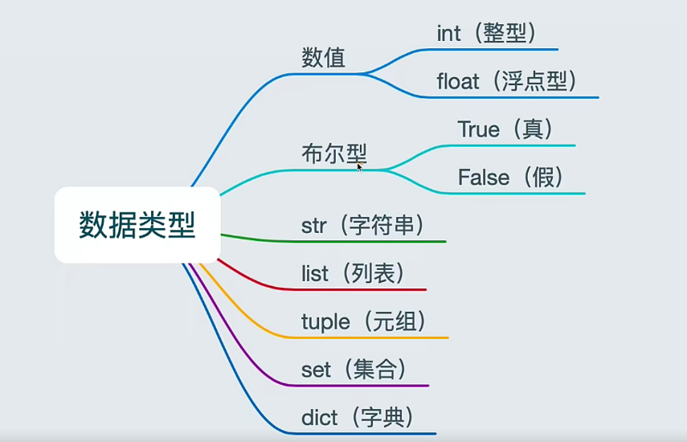

c[toc]

## 数据类型

### 1 什么是数据类型

#### 1.1 数据类型分类图



#### 1.2 数据类型概念

> 弱类型概念：python 变量不限制类型，可以存放任何类型的数据
>
> 强类型概念：java 的变量有严格的类型限制

### 2 数据类型的使用

#### 2.1 整数类型

1. 整型
   > int 成为 整型(表现为我们学的整数)
   > 
   > 语法 n = 2
2. 浮点型
   > float 浮点型（表现为我们学的小数）
   > 
   > 语法：n = 0.01 

#### 2.2 bool (布尔型)

1. True(真)

```python
# bool 值为真用来做判断
flag = True
if flag:
    print("为真打印")
else :
    print("假")
```

2. False(假)

```python
# bool 值为真用来做判断
flag = False
if flag:
    print("为真打印")
else :
    print("假")
```

#### 2.3 str (字符串)

##### 2.3.1 字符串的简单使用

1. 字符串的使用

```python
# 用单引号定义
str1 = 'python'
# 用双引号定义
str2 = "python"
# 单双引号连用可以做到语气强调
str3 = '"你好，能点个赞再走嘛？"'
# 也可以使用 反斜杠 “\” 转义字符将其转换为特殊字符
str4 = '\'你好，小朋友。\''
# 如果不希望使用转义字符，使用原始字符，在字符串前加一个“r”即可
str5 = r'c:\python\name' # 这样可以避开，它将 \n 转换为换行

'''
    想跨行输入，又不想自己添加换行字符，
    使用 """...""" 或 '''  '''，
    字符串行尾会自动加上回车换行，
    如果不需要回车换行，在行尾添加 \ 即可。示例如下
'''
print('''\
    Usage: thingy [OPTIONS]
     -h                        Display this usage message
     -H hostname               Hostname to connect to
''')

```

2. 字符串进行拼接

```python
name = 'python'
# 字符串可以通过 “+” 进行拼接
print('hello' + 'world')
# 如果两个非变量的字符串，不使用 + 也能够拼接
print('hello''world')
# 但如果其中有一个是变量就不可以操作
# print('hello'name) 直接报错，不能通过编译
print('hello' + name)
```


3. 字符串中根据索引取出字符

```python
name = 'python'
# 可以直接所以取出单个字符
print(name[0])
'''
    字符串下标，有两个计算方式
    第一种，从 0 开始：从左的第一字符，依次往右数
        p y t h o n
        0 1 2 3 4 5
    第二种，从 -1 开始：从右的第一个字符，依次往左数
        p   y  t  h  o  n
        -6 -5 -4 -3 -2 -1
'''
# 想取出多个字符，可以通过切片进行处理 
print(name[0:2]) # 左闭右开 只能读取 [0,2) 结果为：py
print(name[2:])  # 表示从 第二个字符到最后一个字符 结果为：thon
print(name[:3])  # 表示从 第0个字符到第三字符，但不包括 结果为：pyt
# 因为切片结果包含开始，不包含结束，因此 s[:i] + s[i:] 总等于他本身
print(name[:2] + name[2:]) # 结果为 python
```

4. 字符串是不可变的
```python
# python 的字符串是 immutable ，不能修改的
# 所以不能给某个索引位置赋值
name = 'python'
# name[0] = 'y'
```

##### 2.3.1 字符串的方法

1. len() 获取字符串长度方法

```python
name = 'hello python'
print(len(name)) # 长度为 12
```

#### 2.4 list (列表)

#### 2.5 tuple (元组)

#### 2.6 set (集合)

#### 2.7 dict (字典)

